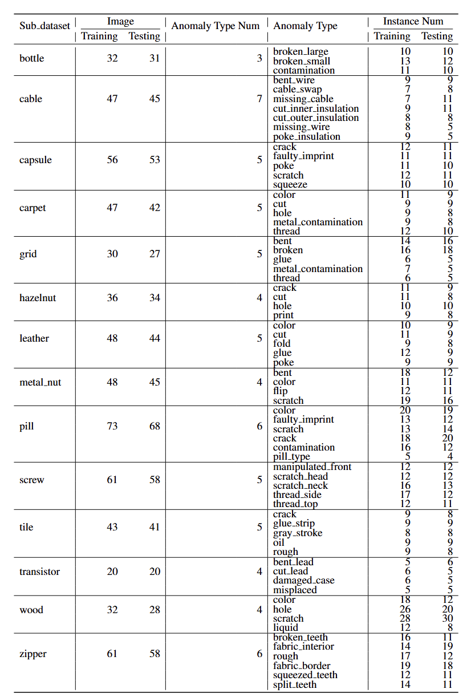
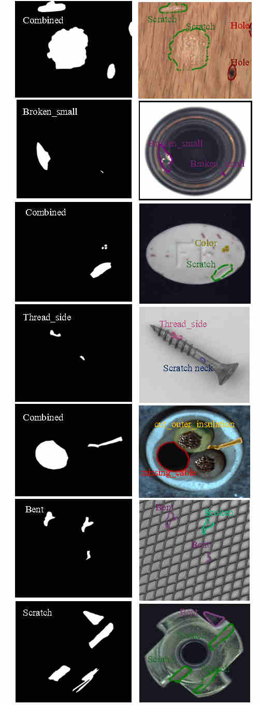

# MVTec-FS Dataset
It is introduced in MVREC: A General Few-shot Defect Classification Model Using Multi-View Region-Context (AAAI 2025)
## Overview

The MVTec-FS dataset is a refined version of the MVTec AD dataset, designed specifically for few-shot learning research. While current anomaly detection tasks primarily focus on defect localization, datasets tailored for defect type classification are rare. To address this gap, we reprocessed the MVTec AD dataset to create a benchmark suitable for:  
<span style="color:green">- Few-shot defect classification tasks.</span>  
Additionaly, it also can be used for:  
<span style="color:green">-Few-shot object detection</span>  
<span style="color:green">- Unified multi-modal classification</span>
## Key Features
- Instance-level annotations created from the original image-level annotations in MVTec AD using connected component algorithms and manual refinement.
- Multi-class anomalies with corrected class labels for individual defect instances.
- Suitable for 1-shot, 3-shot, and 5-shot learning paradigms.
- Includes 14 sub-datasets representing various product categories with distinct anomaly characteristics.

## Dataset Structure
The dataset consists of training and testing sets for each sub-dataset. Each sub-dataset includes anomaly categories and instance counts as detailed below:


For detailed sub-dataset information, see [Table 1](#).

## Annotation Details
- Original coarse image-level annotations are refined into instance-level annotations.
- Connected component algorithms are used to generate instance masks.
- Manual review and adjustment ensure accurate class labels for each defect instance.

Example of label modification:
- Left: Original image-level annotations (MVTec AD).
- Right: Refined instance-level annotations (MVTec-FS).



## Usage
### Dataset Format
The dataset is organized into folders for each sub-dataset, with separate directories for training and testing images. Each image has a corresponding json file (labeme format).

### Download and Decompress the Dataset

Before starting, ensure all split files (e.g., `image.tar.001` to `image.tar.012`) are present in the same directory.

**Merge and Extract:**
Use the following command to combine and extract the dataset files:

```
cat image.tar.* | tar -xvf -
```
### Loading the Dataset
You can load the dataset using common deep learning libraries such as PyTorch or TensorFlow. Example code snippets for loading and preprocessing the dataset will be provided in the repository.

### Few-Shot Learning Experiments
To use the dataset for few-shot learning:
1. Sample the training set to create a support set.
2. Use the testing set as the query set for evaluation.

The dataset supports:
- 1-shot learning
- 3-shot learning
- 5-shot learning

## Citation
If you use MVTec-FS in your research, please cite:

MVREC: A General Few-shot Defect Classification Model Using Multi-View Region-Context (AAAI 2025)

## License
Follow MVTec AD, the dataset is distributed under the [CC BY-NC-SA 4.0](LICENSE).


## Contact
For questions or issues regarding the dataset, please contact:

- Name: LYU Shuai
- Email: shuai.lyu@connect.polyu.hk
